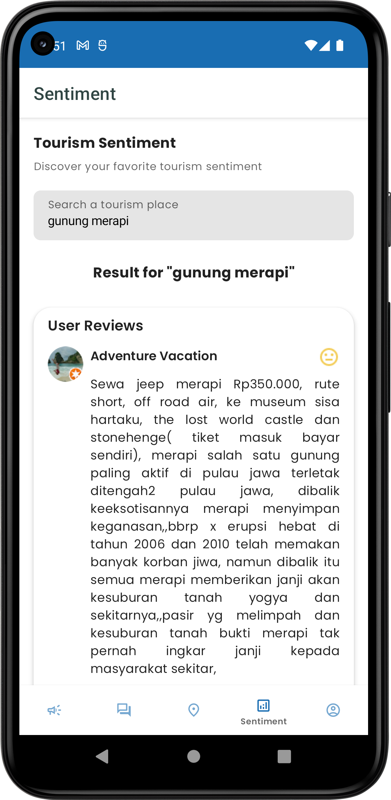

<h1 align="center">
  <br>
  
<br>Traversee ID<br>
    <small style="font-size: 16px;"><em>Discover The Unforgettables</em></small>
</h1>

<!-- Table Of Contents -->
## Table Of Contents
- [Table Of Contents](#table-of-contents)
- [Introduction](#introduction)
- [Features](#features)
- [Installation](#installation)
- [App Architecture](#app-architecture)
- [Project Structure](#project-structure)
- [Credits](#credits)
- [Screenshots](#screenshots)
  - [Campaigns](#campaigns)
  - [Forum](#forum)
  - [Tourism](#tourism)
  - [Sentiment Analysis](#sentiment-analysis)
  - [Profile](#profile)
- [Contact](#contact)

<!-- Introduction -->
## Introduction
Traversee ID is a mobile application designed with the aim of increasing visibility and awareness of Indonesia's tourism potential and empower stakeholders in the industry to better promote their offerings through tourism campaigns. 

The app can also provide a personalized tourism recommendation system, allowing travelers to tailor their itineraries based on their preferences and interests. A forum feature can be included that would allow travelers to connect with each other and share their experiences. Lastly, sentiment analysis can provide feedback on tourist attraction, allowing travelers to make informed decisions.

<!-- Features -->
## Features
- **Authentication**
  - Login
  - Register
  - Forgot password
- **Campaigns** 
  - Find campaigns
  - Filter campaigns by category, location and status
  - Register to a campaign
  - Submit a link submission to a campaign
  - See campaign winners
- **Forum**
  - Create and delete a post
  - See posts
  - Create and delete a comment on a post
  - Like and unlike a Post
- **Tourism**
  - See tourism places
  - Filter tourism places by category and location
  - Add and remove favorite tourism places
  - Get a tourism places recommendation
  - Find open trips
  - Book a trip via Whatsapp
- **Sentiment Analysis**
  - Get a sentiment analysis of a tourism place
- **Profile**
  - Update name and profile picture
  - See registered campaigns
  - See user posts
  - See favorite tourism places
  - Change app language

<!-- Installation Android Kotlin App -->
## Installation
1. Clone this repository
```bash
git clone https://github.com/Traversee-ID/traversee-id-android.git
```
2. Open the project with Android Studio and wait for the Gradle build to finish
3. Run the app on your device or emulator

<!-- App Architecture -->
## App Architecture
The app is built using the MVVM Clean Architecture pattern. The following diagram shows a summary of the app architecture.


<!-- Project Structure -->
## Project Structure
```
├───core
│   ├───common
│   ├───data
│   │   ├───local
│   │   ├───model
│   │   └───remote
│   ├───domain
│   │   ├───entity
│   │   ├───repository
│   ├───presentation
│   │   ├───component
│   │   ├───...screens
│   ├───theme
│   └───util
├───di
├───feature_auth
│   ├───data
│   │   ├───repository
│   ├───domain
│   │   ├───entity
|   |   ├───mapper
│   │   ├───repository
│   │   ├───use_case
│   ├───presentation
│   │   ├───component
│   │   ├───...screens
│   └───util
├───feature_campaign
│   ├───data
│   │   ├───model
│   │   ├───paging_source
│   │   ├───remote
│   │   ├───repository
│   ├───domain
│   │   ├───constant
│   │   ├───entity
│   │   ├───repository
│   │   ├───use_case
│   ├───presentation
│   │   ├───component
│   │   ├───...screens
│   └───util
├───feature_forum
│   ├───data
│   │   ├───model
│   │   ├───paging_source
│   │   ├───remote
│   │   ├───repository
│   ├───domain
│   │   ├───constant
│   │   ├───entity
│   │   ├───repository
│   │   ├───use_case
│   ├───presentation
│   │   ├───component
│   │   ├───...screens
│   └───util
├───feature_sentiment
│   ├───data
│   │   ├───model
│   │   ├───remote
│   │   ├───repository
│   ├───domain
│   │   ├───constant
│   │   ├───entity
│   │   ├───mapper
│   │   ├───repository
│   │   ├───use_case
│   ├───presentation
│   │   ├───component
│   │   ├───sentiment
├───feature_settings
│   ├───data
│   │   ├───model
│   │   ├───remote
│   │   ├───repository
│   ├───domain
│   │   ├───entity
│   │   ├───mapper
│   │   ├───repository
│   │   ├───use_case
│   ├───presentation
│   │   ├───component
│   │   ├───...screens
├───feature_tourism
│   ├───data
│   │   ├───model
│   │   ├───paging_source
│   │   ├───remote
│   │   ├───repository
│   ├───domain
│   │   ├───entity
│   │   ├───repository
│   │   ├───use_case
│   ├───presentation
│   │   ├───component
│   │   ├───...screens
│   └───util
├───navigation
```

<!-- Credits -->
## Credits
- [Firebase Authentication](https://firebase.google.com/)
- [Kotlin](https://kotlinlang.org/)
- [Android Studio](https://developer.android.com/studio)
- [Jetpack Compose](https://developer.android.com/jetpack/compose)
- [Compose Destinations](https://composedestinations.rafaelcosta.xyz/)
- [Retrofit](https://square.github.io/retrofit/)
- [Jetpack Libraries](https://developer.android.com/jetpack)
- [Coil](https://coil-kt.github.io/coil)
- [Dagger Hilt](https://dagger.dev/hilt)
- [Lottie](https://lottiefiles.com)

## Screenshots
### Campaigns
     

### Forum
  

### Tourism
    

### Sentiment Analysis


### Profile
    

<!-- Contact -->
## Contact
- [Github](https://github.com/alvintriseptia)
- [Linkedin](https://www.linkedin.com/in/alvin-triseptia-mairis/)
